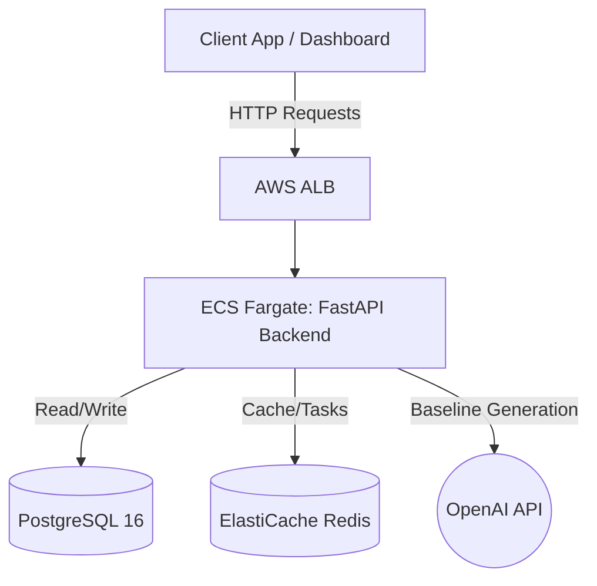

# AIVAR Baseline Generation & Drift Monitoring API

AIVAR (Artificial Intelligence Virtual Assistant Reliability) is a robust backend system designed to generate behavioral baselines for AI agents and monitor their behavior in production for any "drift" or anomalous activity.

This system is built using **FastAPI** (Python 3.13), **PostgreSQL**, **Redis**, and is fully containerized using **Docker** with an infrastructure-as-code deployment pipeline using **Terraform** for **AWS**.

---

## 🚀 Features

- **Agent Management**: Register and manage AI agent profiles (versions, models, configurations).
- **Synthetic Baseline Generation**: Uses OpenAI's GPT-4o-mini to generate 50+ diverse conversational scenarios and mock responses, creating a statistically significant "fingerprint" of the agent's expected behavior (latency, verbosity, tool usage, sentiment).
- **K-Means Clustering**: Automatically categorizes the generated scenarios into clusters (e.g., FAQ, Troubleshooting, Aggressive User) to ensure broad behavioral coverage.
- **Drift Monitoring & Anomaly Detection**: Real-time API endpoints to stream production telemetry against the agent's baseline. Detects behavioral drift using Total Variation Distance (TVD) for tool usage, and Z-scores for latency/verbosity.
- **Alerting System**: Flags "Warning" or "Alert" anomalies in real-time, storing them in PostgreSQL for dashboards.
- **Enterprise-grade Logging**: Structured JSON logging using `loguru` and built-in audit trails for security events.
- **Containerized & Cloud Ready**: Fully containerized with Docker, scalable via AWS ECS Fargate.

---

## 🏗️ Architecture



---

## 💻 Running Locally (Docker)

The easiest way to run the project locally is using Docker Desktop. This will start the FastAPI backend, a local PostgreSQL database, and a Redis instance.

### Prerequisites
1. Install [Docker Desktop](https://www.docker.com/products/docker-desktop/).
2. Get an OpenAI API Key.

### Steps

1. **Clone the repository and enter the directory.**
2. **Create a `.env` file** in the project root:
   ```env
   OPENAI_API_KEY=sk-your-openai-key
   JWT_SECRET_KEY=my-super-secret-local-key
   ```
3. **Build and Start the services:**
   ```bash
   docker compose up -d --build
   ```
4. **Verify it's running:**
   ```bash
   curl http://localhost:8000/health
   ```
   *(Expected output: `{"status": "healthy"}`)*

The API Documentation (Swagger UI) is available at: **http://localhost:8000/docs**

---

## 🕹️ How to Use the API (The Core Flow)

Here is the step-by-step lifecycle of how this API is meant to be used. You can test these exact inputs via the Swagger UI (`http://localhost:8000/docs`).

### 1. Register an Agent
First, you tell the system about your AI agent.
**`POST /agents/`**
```json
{
  "name": "CustomerSupportBot",
  "version": "1.0",
  "model": "gpt-4",
  "system_prompt": "You are a helpful customer support agent for a shoe store. You can search inventory and process returns."
}
```
*(Save the returned `agent_id`)*

### 2. Generate a Baseline (Synthetic Fingerprinting)
Ask the system to generate a baseline. This will call OpenAI 50 times in the background to simulate conversations with your agent.
**`POST /scenarios/generate`**
```json
{
  "agent_id": "<your_agent_id>",
  "num_scenarios": 50,
  "agent_prompt": "You are a helpful customer support agent for a shoe store. You can search inventory and process returns."
}
```
*Note: This takes about 30 seconds as it performs k-means clustering and calculates the statistical baseline.*

### 3. Monitor Production Traffic (Detecting Drift)
As your bot runs in the real world, send its telemetry to this endpoint. The system will compare it against the baseline.
**`POST /monitoring/`**
```json
{
  "agent_id": "<your_agent_id>",
  "session_id": "sess_12345",
  "user_input": "I want a refund right now! These shoes are terrible.",
  "response_length": 1500, 
  "latency_ms": 4500,
  "tool_count": 0,
  "tool_sequence": []
}
```
**If the response is vastly different from the baseline (e.g. usually latency is 1000ms, but here it's 4500ms), the system will return a `Warning` or `Alert` status and record an Anomaly in the database!**

---

## ☁️ Deployment (AWS via Terraform)

To deploy to AWS, ensure you have the AWS CLI configured and Terraform installed.

1. `cd terraform`
2. `terraform init`
3. `terraform plan` (Review the infrastructure to be created)
4. `terraform apply` (Provisions the VPC, ECS, RDS, and ElastiCache).

See `ops_runbook.md` for detailed operational procedures, database migrations, and CI/CD instructions.
